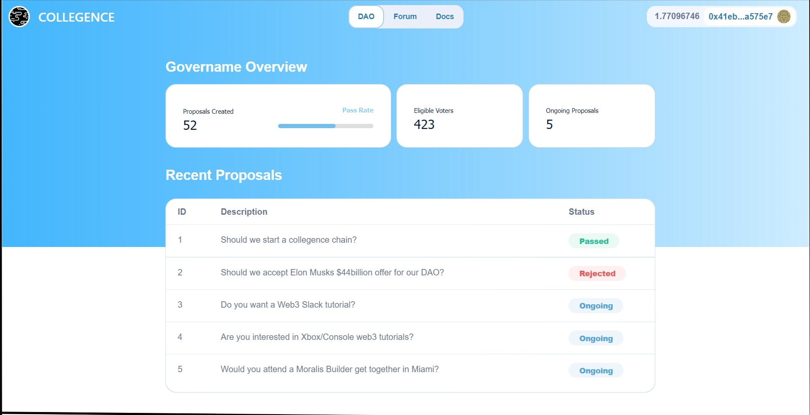

<p align="center">

<h2 align="center"> Collegence DAO </h2>

<p align="center">Collegence is a decentralized autonomous organisation (DAO) <br>that has no central governing body is collectively-owned, blockchain<br>-governed oraganisation working towards a shared mission.</p>


</p>

Blockchain Network: **Polygon Mumbai**  
 Contract Address: [0x08e081fc2Ff1dAa884c1107C13C59037268b5AE4](https://mumbai.polygonscan.com/address/0x08e081fc2Ff1dAa884c1107C13C59037268b5AE4#code)  
 DApp Address: [IPFS](collegence.on.fleek.co)

## TECHSTACK

|                 | `SMART CONTRACT` | `FRONTEND`               |
| --------------- | ---------------- | ------------------------ |
| **Language**    | Solidity         | JavaScript               |
| **Framework**   | Hardhat          | Next JS <br> Tailwindcss |
| **Library**     | Ethers           | Moralis <br> Web3uikit   |
| **Deployed to** | Polygon Mumbai   | IPFS                     |

Dependencies :

- **Node.JS**
- **Metamask**

You need to have metamask installed in your browser and connect to Polygon Mumbai testnet. You also need to have some testnet Polygon Mumbaia and Member NFT Tokens tokens for voting.

---

## GETTING STARTED

```bash
git clone http://www.github.com/subrotokumar/collegence-dao.git
cd collegence-dao
yarn
yarn dev
```
